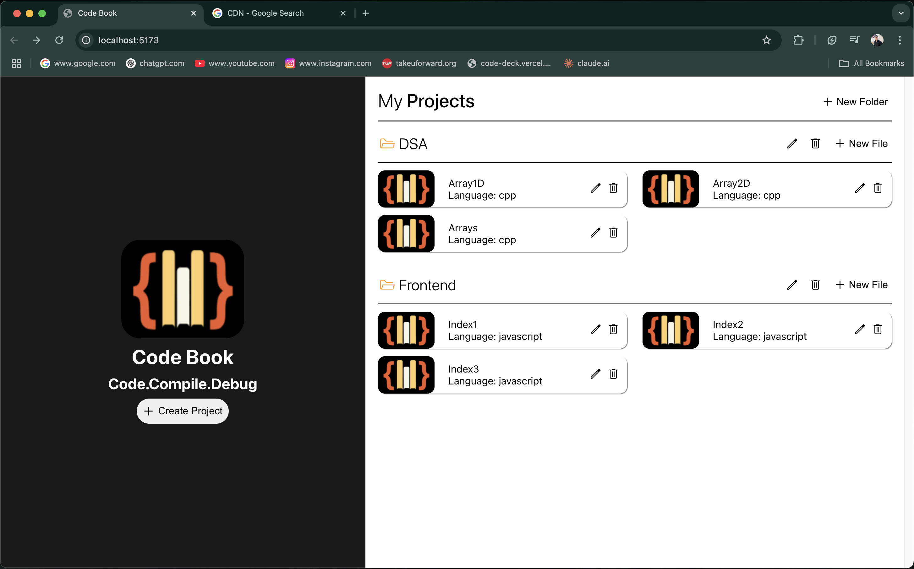
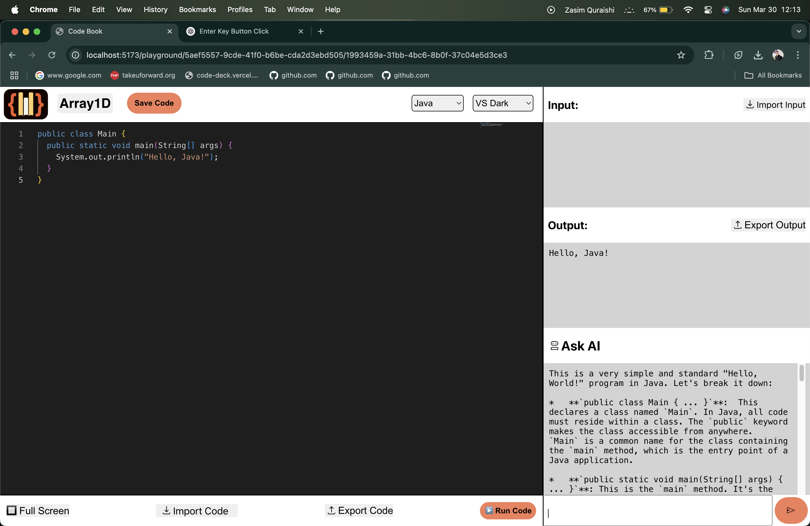

# Project Judge - An Online Code Editor

## Project Overview
This document outlines the development of an Online Code Editor web application built using React and Vite. The platform aims to provide developers with a browser-based coding environment that offers real-time code execution, syntax highlighting, and collaborative features.

## Technical Architecture
- **Frontend Framework**: React.js
- **Build Tool**: Vite
- **Development Environment**: Visual Studio Code on macOS
- **Key Dependencies**:
  - Monaco Editor (code editing component)
  - Import Themes from the Monaco Editor
  - Compiler/Interpreter APIs from Judge0 (real-time collaboration) for code execution

## Core Features
1. **Multi-language Support**: CPP, Python, Java, and Javascript
2. **Multiple Code Files and Folders**: Multiple code files and Folders which you can manipulate
3. **Real-time Code Execution**: Browser-based compilation and execution of code
4. **Syntax Highlighting**: Language-specific code highlighting for improved readability
5. **Auto-completion**: Intelligent code suggestions based on context
6. **Save Code Files**: Save you code files in your Browser Local memory
7. **Collaborative Editing**: Real-time collaboration allowing multiple users to edit simultaneously
8. **User-Friendly Design**: Optimized and interactive for new users
9. **Import Input and Export Output**: Optimized for both desktop and mobile devices
10. **Default Codes for Default Language**: Get default codes Automatically while choosing language
11. **Multiple Themes Support**: Multiple themes and syntax to keep you engaged
12. **Public Accessible**: Free to use for everyone
13. **Two Different Screens**: 1)HomePage:-  2)Editor page:- 

## Implementation Strategy
The application follows a component-based architecture with:
- Editor Component: Integrating Monaco Editor with custom configurations
- Output Component: Displaying execution results and errors
- Collaboration Service: Managing Judge0 server connections for real-time updates and compilation
- Storage Service: Handling and storing your data in your local storage 
- Import and Export: Work with code, input, and output

## User Experience Considerations
- Minimalist interface with focus on the code editor
- Customizable themes (light/dark modes)
- Keyboard shortcuts for common operations
- Split-screen views for code and output
- Session persistence to prevent work loss

## Deployment Strategy
The application will be deployed using:
- CDN for static assets to improve loading performance
- Scalable frontend services to handle varying user loads

## Live Project Link:- https://project-judge1.vercel.app/
